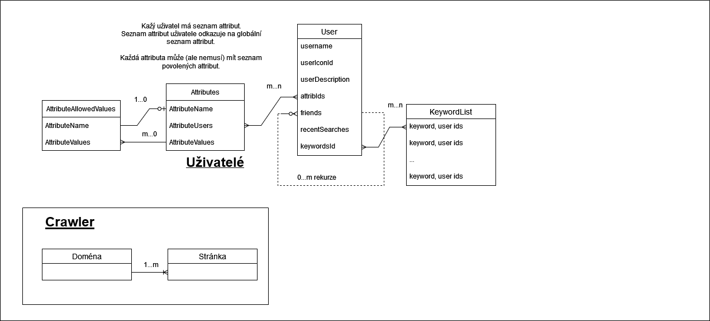

# NPWS
independent search engine, written in C and JS (+ will add Python for user mgmt)

# O vyhledávači
Vyhledávač (s pracovním názvem NPWS) je plně nezávislý vyhledávač s vlastním crawlerem a serverem podávájícím informace frontendu.
Crawler prohledává stránky a ukládá informace do dvou databází - databází domén a stránek. Webserver odpovídá na HTTP requesty frontendu a posílá informaci o jenotlivé stránce, potom co jí v databázi našel a uložil počet zhlédnutí.
Crawler a webserver jsou napsány v jazyce C, frontend je napsán v jazyce JS. Backend pro uživatelské informace je napsán v Pythonu.
Crawler dodržuje RFC 9309, jinak známý jako "Robots Exclusion Protocol" nebo "robots.txt". Crawler umí sledovat sitemapy, včetně vrstvených. Neumí sledovat komprimované sitemapy (s koncovkou .gz).
Webserver requesty nešifruje. Uživatelská informace je šifrována. Uživatelé mohou vytvářet účty a úkládát svá nastavení.

Na hlavní strance je logo, pole pro vyhledávání a odkaz na uživatelská nastavení.

Na stránce výsledků je vyhledávací pole, seznam výsledků a dolní panel.

Na stránce uživatele jsou nastavení jako uživatele, tak i programu. Všechna tyto nastavení jsou pro každého uživatele uloženy zvlášť.

V administraci se spravuje jak běh webcrawleru, webserveru i správa databází stránek, domén i uživatelů.

V mobilní verzi je navigace uskutečněna za pomocí dolního panelu. V desktopové verzi je navigace uskutečněna funkcemi prohlížeče.

# Wireframes (Mobile)
### Home

### Results

### User

# Wireframes (Desktop)
### Home

### Results

### User

# Database schema

